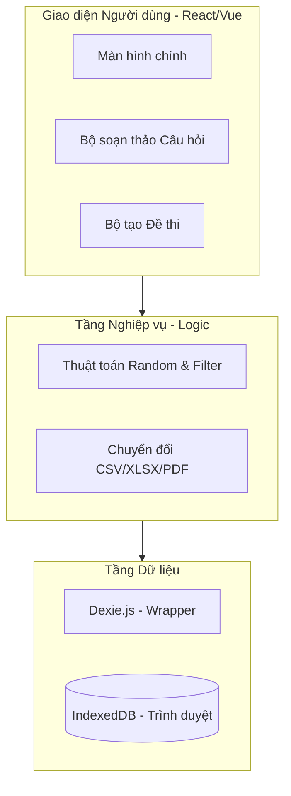
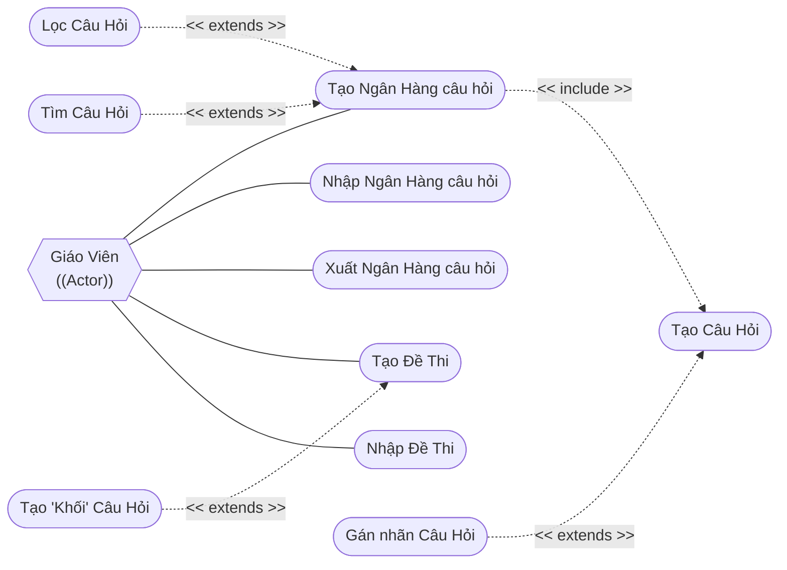
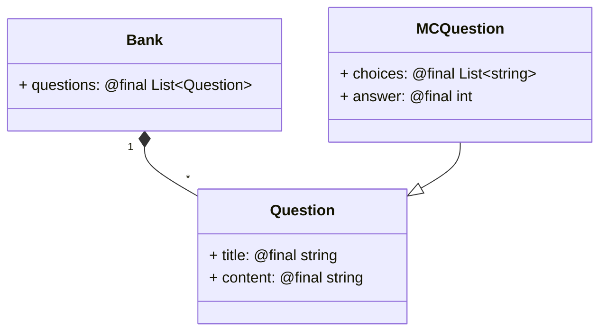
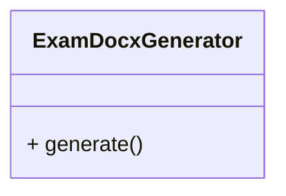

# THIẾT KẾ DỰ ÁN (Design Document)
## 1. Tổng quan dự án
### 1.1. Bối cảnh
### 1.2. Mục đích và mục tiêu dự án
#### 1.2.1. Mục đích dự án
#### 1.2.2. Mục tiêu dự án
### 1.3. Phạm vi dự án
### 1.4. Định hướng kỹ thuật
#### 1.4.1. Kiến trúc tổng thể: Offline-First Web App (PWA)
Vì yêu cầu nhấn mạnh vào việc sử dụng **IndexedDB** và xử lý tệp tin (.csv, .xlsx, .pdf) nhanh chóng, kiến trúc **Offline-first** là lựa chọn tối ưu.
- **Lý do:** Giáo viên thường có nhu cầu soạn thảo câu hỏi liên tục. Việc lưu trữ trực tiếp vào IndexedDB giúp ứng dụng hoạt động ngay cả khi không có mạng, tốc độ phản hồi gần như tức thì vì không phải chờ đợi API từ Server.
#### 1.4.2. Kiến trúc Module (Frontend Structure) - *Layered Architecture*
##### A. Presentation Layer (Giao diện)

- Sử dụng các Component để hiển thị danh sách câu hỏi, form tạo câu hỏi, và trình xem trước đề thi (PDF).
    

##### B. Business Logic Layer (Tầng nghiệp vụ)

- **Generator Service:** Chứa thuật toán chọn ngẫu nhiên câu hỏi dựa trên `tag` và số lượng yêu cầu (Requirement 3.4).
    
- **Import/Export Service:** Xử lý logic đọc/ghi file CSV/XLSX bằng các thư viện như `SheetJS (xlsx)` hoặc `PapaParse`.
    

##### C. Data Access Layer (Tầng dữ liệu)

- Đây là nơi bạn làm việc với **IndexedDB**. Thay vì gọi API `fetch`, bạn gọi các hàm trong tầng này để lưu `Bank` và `Question`.
#### 1.4.5. Sơ đồ kiến trúc


## 2. Các bên liên quan (Stakeholders)

| Stakeholders | Vai trò và yêu cầu                                                                  |
| ------------ | ----------------------------------------------------------------------------------- |
| Giáo viên    | Tạo, nhập, xuất ngân hàng câu hỏi. <br>Từ ngân hàng câu hỏi tạo ngẫu nhiên) đề thi. |
## 3. Yêu cầu chức năng (Functional Requirements)
- Tạo ngân hàng câu hỏi.
- Nhập, xuất ngân hàng câu hỏi.
- Tạo ngẫu nhiên đề thi từ ngân hàng câu hỏi.
- Nhập, xuất đề thi.
### 3.1. Tạo ngân hàng câu hỏi
Giáo viên tạo câu hỏi với tỉ lệ thành công 99%, ứng dụng sẽ hiển thị câu hỏi vừa được tạo ra ngay lập tức (phản hồi dưới 2s). Câu hỏi có thể được gán nhãn (`tag`) để phân loại và phục vụ cho quá trình tạo đề thi.
### 3.2. Xuất ngân hàng câu hỏi
Giáo viên xuất ngân hàng câu hỏi ra 1 tệp (.json, .csv, .xlxs, ...) phổ biến để lưu trên máy hoặc đồng bộ thủ công. Tỉ lệ thành công là 95%, tệp được xuất trong vòng 5s.
### 3.3. Nhập ngân hàng câu hỏi
Giáo viên nhập ngân hàng câu hỏi từ 1 tệp (.json, .csv, .xlxs, ...) để lấy dữ liệu từ tệp và đưa vào ngân hàng câu hỏi trong ứng dụng. Tỉ lệ thành công là 95%, tệp được nhập trong vòng 5s.
### 3.4. Tạo đề thi từ ngân hàng câu hỏi
Giáo viên tạo 1 đề thi, có thể chọn câu hỏi ngẫu nhiên (tùy chỉnh số lượng câu hỏi) hoặc câu hỏi tùy ý trong ngân hàng câu hỏi. Câu hỏi có thể được phân loại theo các nhãn (`tag`) và số lượng câu hỏi theo nhãn có thể được tùy chỉnh nếu tạo ngẫu nhiên. Tỉ lệ tạo đề thi thành công là 99%, đề thi được tạo xong sẽ hiển thị trong vòng 5s
### 3.5. Xuất đề thi ra tệp
Đề thi được tạo xong có thể xuất ra tệp (.pdf, .docx, ...). Tỉ lệ thành công là 95%, tệp được xuất trong vòng 5s.

## 4. Yêu cầu phi chức năng (Non-functional Requirements)

### 4.1. Hiệu năng (perfomance)

## 5. Use-case và kịch bản vận hàng (scenario)
### 5.1. Use-case toàn hệ thống

### 5.2. Giáo viên

#### 5.2.1. Tạo Ngân Hàng Câu Hỏi

| ID               | UC-Teacher-001                                                                                                                                                                                            |
| ---------------- | --------------------------------------------------------------------------------------------------------------------------------------------------------------------------------------------------------- |
| Use-case         | Tạo ngân hàng câu hỏi                                                                                                                                                                                     |
| Actor            | Giáo Viên (Teacher)                                                                                                                                                                                       |
| Description      | Giáo viên tạo ngân hàng câu hỏi.                                                                                                                                                                          |
| Pre-condition    | Đang ở DashBoard.                                                                                                                                                                                         |
| Post-condition   | 1. Dữ liệu lưu vào IndexedDB của trình duyệt. <br>2. Hiển thị các câu hỏi lên màn hình ứng dụng.                                                                                                          |
| Trigger          | Người dùng truy cập ứng dụng.                                                                                                                                                                             |
| Normal Flow      | 1. Người dùng truy cập ứng dụng.<br>2. Người dùng tạo Câu Hỏi. (UC-Teacher-002)                                                                                                                           |
| Alternative Flow | (1) A1.a. Người dùng nhập Ngân Hàng. [UC-Teacher-004]<br>A1.b. Ứng dụng cập nhật dữ liệu.<br>(1) A2.a. Người dùng xuất Ngân Hàng. [UC-Teacher-005]<br>A2.b. Người dùng tải về tệp chứa dữ liệu Ngân Hàng. |
| Exception Flow   | E1. Dung lượng bộ nhớ trình duyệt đầy; hiện lỗi lên.<br>E2. Trình duyệt không hỗ trợ IndexedDB; hiện lỗi lên, yêu cầu người dùng đổi sang trình duyệt mới hơn.                                            |

#### 5.2.2. Tạo Câu Hỏi
| ID               | UC-Teacher-002                                                                                                                                          |
| ---------------- | ------------------------------------------------------------------------------------------------------------------------------------------------------- |
| Use-case         | Tạo Câu Hỏi                                                                                                                                             |
| Actor            | Giáo Viên (Teacher)                                                                                                                                     |
| Description      | Giáo viên tạo câu hỏi khi đang ở trong màn hình tạo Ngân Hàng câu hỏi.                                                                                  |
| Pre-condition    | Đang tạo Ngân Hàng câu hỏi.                                                                                                                             |
| Post-condition   | 1. Dữ liệu câu hỏi được tạm lưu trữ trên ứng dụng. <br>2. Hiển thị câu hỏi lên màn hình ứng dụng.                                                       |
| Trigger          | Người dùng chọn tạo câu hỏi.                                                                                                                            |
| Normal Flow      | 1. Người dùng chọn tạo Câu Hỏi.<br>2. Người dùng chọn loại Câu Hỏi. (Đúng/Sai, Trắc Nghiệm, Tự Luận.)<br>3. Người nhập nội dung Câu Hỏi (tùy vào loại). |
| Alternative Flow | (1) A1. Người dùng gán nhãn cho Câu Hỏi. [UC-Teacher-003]                                                                                               |
| Exception Flow   |                                                                                                                                                         |
#### 5.2.3. Gán nhãn Câu Hỏi
| ID               | UC-Teacher-003                                                                                                       |
| ---------------- | -------------------------------------------------------------------------------------------------------------------- |
| Use-case         | Gán nhãn Câu Hỏi                                                                                                     |
| Actor            | Giáo Viên (Teacher)                                                                                                  |
| Description      | Giáo viên gán nhãn Câu Hỏi khi đang tạo Câu Hỏi.                                                                     |
| Pre-condition    | Đang tạo Câu Hỏi.                                                                                                    |
| Post-condition   | 1. Cập nhãn cho dữ liệu nhãn cho câu hỏi vô IndexedDB.                                                               |
| Trigger          | Người dùng ấn "Gán Nhãn".                                                                                            |
| Normal Flow      | 1. Người dùng điền tên Nhãn.<br>2. Người dùng ấn Enter, hoặc nút tích.<br>3. Dữ liệu nhãn của câu hỏi được cập nhật. |
| Alternative Flow | (2) A1. Sau khi tạo xong nhãn, người dùng có thể ấn nút "X" bên cạnh nhãn để xóa nhãn.                               |
| Exception Flow   |                                                                                                                      |
#### 5.2.4. Xuất Ngân Hàng
| ID               | UC-Teacher-003                                                                                                   |
| ---------------- | ---------------------------------------------------------------------------------------------------------------- |
| Use-case         | Xuất Ngân Hàng                                                                                                   |
| Actor            | Giáo Viên (Teacher)                                                                                              |
| Description      | Giáo viên Xuất Ngân Hàng ra file (.json, .csv, .xlxs, ...)                                                       |
| Pre-condition    | Đang ở DashBoard, có ít nhất một Ngân Hàng.                                                                      |
| Post-condition   | 1. Tệp xuất ra được lưu trên máy cục bộ của người dùng.                                                          |
| Trigger          | Người dùng ấn icon "Xuất Tệp" ở thẻ Ngân Hàng.                                                                   |
| Normal Flow      | 1. Hiển thị cửa sổ lưu file<br>2. Người dùng chọn vị trí lưu.<br>3. Xuất và lưu file tại vị trí người dùng chọn. |
| Alternative Flow |                                                                                                                  |
| Exception Flow   | E1. Trình duyệt không hỗ trợ lưu file; hiện lỗi lên.                                                             |
#### 5.2.5. Nhập Ngân Hàng
| ID               | UC-Teacher-003                                                                                                 |
| ---------------- | -------------------------------------------------------------------------------------------------------------- |
| Use-case         | Nhập Ngân Hàng                                                                                                 |
| Actor            | Giáo Viên (Teacher)                                                                                            |
| Description      | Giáo viên Nhập Ngân Hàng từ file (.json, .csv, .xlxs, ...)                                                     |
| Pre-condition    | Đang ở DashBoard.                                                                                              |
| Post-condition   | 1. Dữ liệu Ngân Hàng được cập nhật vô IndexDB.                                                                 |
| Trigger          | Người dùng ấn icon "Nhập Tệp" ở DashBoard.                                                                     |
| Normal Flow      | 1. Hiển thị cửa sổ chọn file.<br>2. Người dùng chọn đường dẫn tới file.<br>3. Nhập dữ liệu vô IndexDB từ file. |
| Alternative Flow |                                                                                                                |
| Exception Flow   | E1. Trình duyệt không hỗ trợ nhập file; hiện lỗi lên.                                                          |
### Sơ đồ cấu trúc (Structural Diagram)
### 6.1. Class Diagram
#### 6.1.1. Data Classes


#### 6.1.2. Logic Classes

## 7. Cấu trúc dự án (TMP Project Structure)
```
exam-helper/
├── public/                 # Tài nguyên tĩnh (Logo, Manifest, Service Worker)
├── src/
│   ├── assets/             # Hình ảnh, font, styles toàn cục
│   ├── core/               # Tầng Business Logic (Pure TypeScript)
│   │   ├── entities/       # Khai báo Class/Interface (Bank, Question, Exam)
│   │   ├── services/       # Logic nghiệp vụ chính
│   │   │   ├── generator.ts      # Thuật toán chọn câu hỏi ngẫu nhiên
│   │   │   ├── docx-export.ts    # Logic tạo file .docx (dùng docx)
│   │   │   ├── excel-handler.ts  # Logic đọc/ghi file Excel (dùng SheetJS)
│   │   │   └── pdf-export.ts     # Logic tạo file PDF
│   │   └── utils/          # Các hàm tiện ích (Format date, string helper)
│   │
│   ├── data/               # Tầng Data Access (Làm việc với DB)
│   │   ├── db.ts           # Khởi tạo Dexie.js (Schema & Stores)
│   │   └── repositories/   # Các hàm CRUD (getBank, saveQuestion,...)
│   │
│   ├── ui/                 # Tầng Presentation (Giao diện)
│   │   ├── components/     # Các thành phần dùng chung (Button, Modal, Card)
│   │   ├── layouts/        # Layout chính (Sidebar, Header)
│   │   ├── pages/          # Các màn hình chính
│   │   │   ├── Dashboard/  # Trang chủ
│   │   │   ├── BankEditor/ # Trang soạn thảo câu hỏi
│   │   │   └── ExamGen/    # Trang tạo đề thi
│   │   └── hooks/          # Custom Hooks để kết nối UI và Logic (useBank, useExam)
│   │
│   ├── App.tsx             # Component gốc
│   ├── main.tsx            # Entry point
│   └── service-worker.ts   # Cấu hình PWA để chạy offline
│
├── tests/                  # Unit tests cho thuật toán tạo đề
├── .env                    # Biến môi trường
├── tsconfig.json           # Cấu hình TypeScript
├── vite.config.ts          # Cấu hình Vite & PWA Plugin
└── package.json
```
